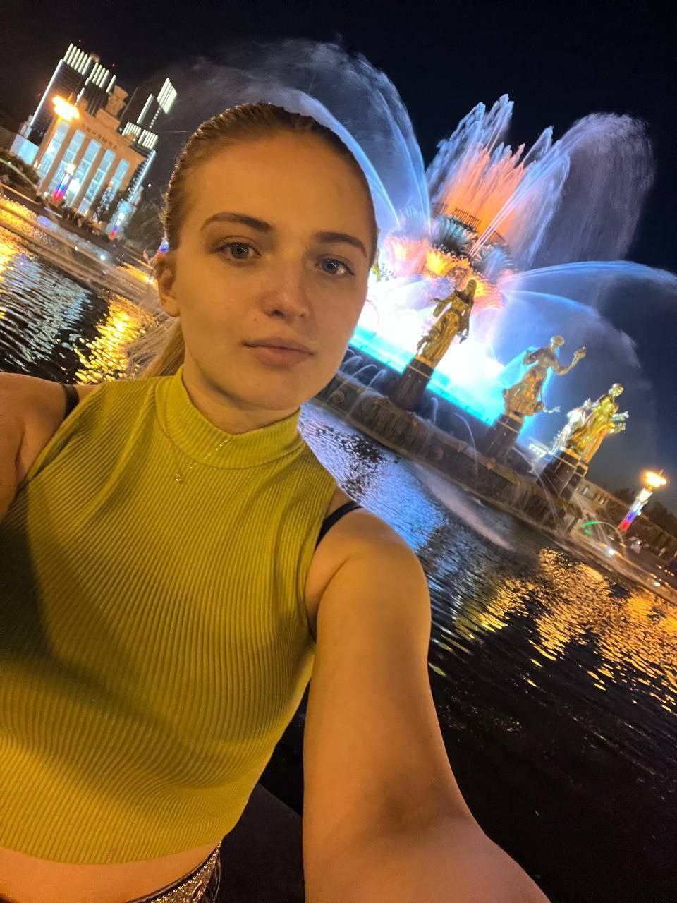

Привет! 
Рада видеть тебя на моём первом сайте (он создан с помощью GitHub Pages & Markdown)

 

Давай знакомиться! Начну с себя.

 

Меня зовут Надя, мне 18, родилась я 26.09.2006 (сразу создай напоминание в календаре 😁)

 

Родилась и живу в сердце России — в Москве.

 

  
  

  

Итак... что же меня привело к тому, что сейчас я пишу сайт...

 

Ещё со школьных времён я ненавидела информатику. Мне она казалась слишком скучной. Мы писали простейший код на Python ещё в 7 классе. Для меня тогда это выглядело как работа бухгалтера, который заполняет отчёты: много скучного текста, а главное — никакого глобально полезного результата.

 

_**Тогда я поняла: IT — последняя сфера, которой я буду заниматься**_

 

С того времени я успела многим позаниматься. В 2022–2023 я занималась арбитражом криптовалют в связи с изменённой экономической ситуацией в странах СНГ. Это было очень выгодно. У меня даже был обыск, хахаха =). Дальше я занималась аирдропами (участвовала в ранней активности блокчейн-проектов ради будущих наград) децентрализованных проектов (не Telegram-боты, поинтереснее). Летом 2024 года я получила $3000–$3500 с аирдропов. Эту ликвидность я перелила в трейдинг, обучение по трейдингу, а также потратила на аренду крутых апартаментов в Москва-Сити, поездку в Санкт-Петербург, покупку компьютера. Впоследствии торговли я деньги потеряла.

 

Шёл 2025 год. Мир меняется, технологии развиваются, а я всё как будто на месте стою. 

 

_Важно сказать, что с детства я необъяснимо увлечена технологиями. Естественно, как только появились нейросети, я сразу же начала с ними взаимодействовать. Я с увлечением писала промты для чата GPT ещё в 2023 году. Мне это действительно нравится._

 

Весна 2025 года. Просыпаюсь в районе 00 ночи, иду в душ, где мне приходит гениальная мысль: "Если я так люблю взаимодействовать с нейросетями, почему тогда я опираюсь на предрассудки своей 13-летней версии, что IT — это наискучнейшая сфера во Вселенной??"

 

(Интересный факт: в душе мозг входит в тета-состояние, которое приводит к генерации новых идей. Нередко Эйнштейн пользовался этой техникой для решения задач.)

 

3 дня и 3 ночи я обдумываю эту идею, читаю статьи, пробую сама написать код, простейший код на Python. К моему большому удивлению, что-то внутри меня говорит: "Вот оно, что ты искала."

 

После оценки рынка принимаю решение начать свой путь развития в Нетологии.

 

Почему Fullstack?

 

Очень просто. Я хочу создавать процесс, хочу генерировать решения задач, создавать новое. Очевидно — Backend. 

 

Но что лучше:
1. Когда я знаю, как написать архитектуру приложения, но понятия не имею, как это всё будет высвечиваться. 
2. Когда я могу создать механизм работы, при этом покреативить во фронте — быть универсальным специалистом.
Очевидно, что вариант 2

 

Сейчас я уже пишу простой код на Python и решаю несложные задачи. Работаю со списками (list), кортежами (tuple), множествами (set), словарями (dict). Могу написать простую функцию (def). Также знаю структуру и функционал некоторых функций высшего порядка (lambda, map, filter и т. д.), но требуется доработка. В ближайшие дни хочу написать Python-калькулятор и залить на GitHub. 

 

Мои цели в IT

 

Сейчас я буду продолжать обучение в Нетологии и раскачивать свой GitHub. К зиме я очень хочу выйти на стажировку в качестве Backend Developer в Яндекс. Да, именно Яндекс. Именно эта компания меня вдохновляет на российском рынке больше всего!

 

Параллельно я буду изучать английский (сейчас уровень A2, требуется B2). Помимо того, что я очень хочу путешествовать, я буду сдавать экзамен GED (в США и странах Евросоюза приравнивается к High School Diploma), который в дальнейшем позволит мне пройти программу Foundation (подготовительная программа для поступления в вуз за границей) и поступить на заочное обучение в американский, канадский или европейский вуз.

 

Вдохновение

 

Больше всего сейчас мотивирует осознание безграничных возможностей, которые рождаются из комбинаций ноликов и единиц — из кода.  
Перспективы, которые открывает нам машинное обучение. Да, я хочу именно им заниматься.  
Будущее, которое является лучшим только в тесной командной работе инженеров, программистов, исследователей — тех, кто объединяет алгоритмы, физику и материю в одну систему. 

      

И самое главное: я могла наблюдать, как будущее строится на моих глазах, но я выбираю стать частью этого прогресса.

      

Let's go coding 🌌

